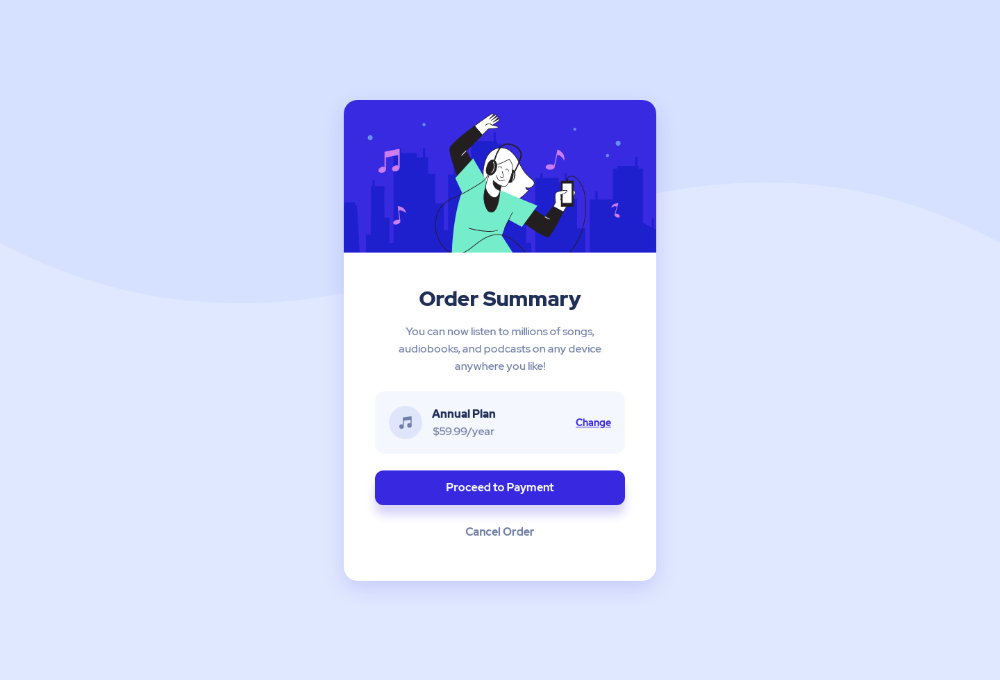

# Order Summary Card

  
  
  
  
  

  

## Feedback and Live Review
* [🌍 Live Review](https://vanzaordersummary.netlify.app/)
* [👉 Give feedback on Frontend Mentor platform](https://www.frontendmentor.io/solutions/order-summary-component-html-css-sass-odJjpO-TN)
* [🐦 Give Feedback on Twitter](https://twitter.com/vanzasetia/status/1424943859008630785?s=19)

## Screenshot

## Table of contents
- [Story](#the-story-when-doing-this-challenge)
- [What I Learned](#what-i-learned)
- [Technology that I used](#built-with)
- [Continued Development](#continued-development)
- [Author](#author)

## The Story When Doing This Challenge
I noticed that the `style-guide.md` didn't provide the `active-states` color. So, I used color picker and got this color code `rgb(118, 108, 241)`.

I also got confused on the `font-weight`. I used `900` on `Order Summary` and `Annual Plan`. For the `Proceed Payment` and `Cancel Order`, I used `700` and the rest used `500`. You can double check if you want to make sure that what I said is true or not.

For the breakpoint, I only used `320px`, `400px`, and `750px`. First on `320px` breakpoint for the smallest screen width, I made the music icon hidden. On `400px`, I made the `Order Summary` bigger. Lastly, on `750px` I used `pattern-background-desktop.svg`.

## What I Learned
* Don't underestimate newbie challenges 😉.

## Built With
This project is created using **HTML5**, **CSS3**, and **Sass**. 

  
  
  

## Continued development
I will take people feedback and improve this solution.

## Author
- Frontend Mentor - [@vanzasetia](https://www.frontendmentor.io/profile/vanzasetia)
- Twitter - [@vanzasetia](https://www.twitter.com/vanzasetia)